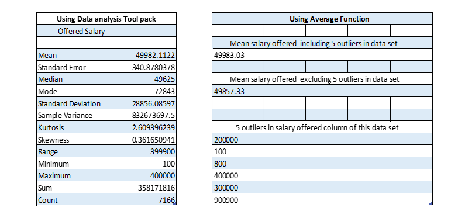
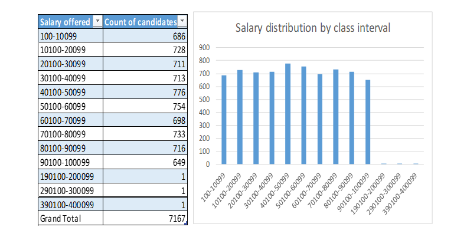
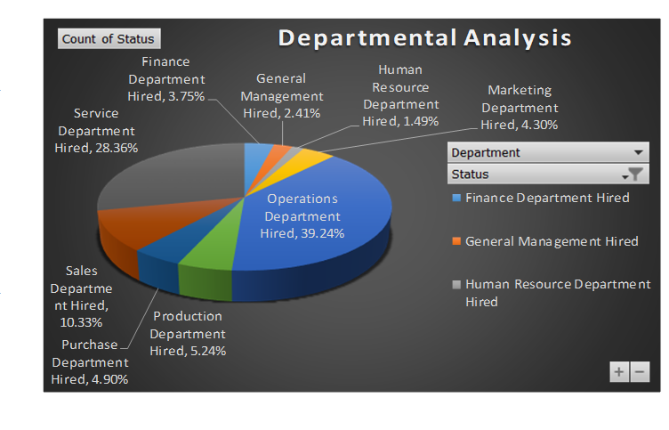
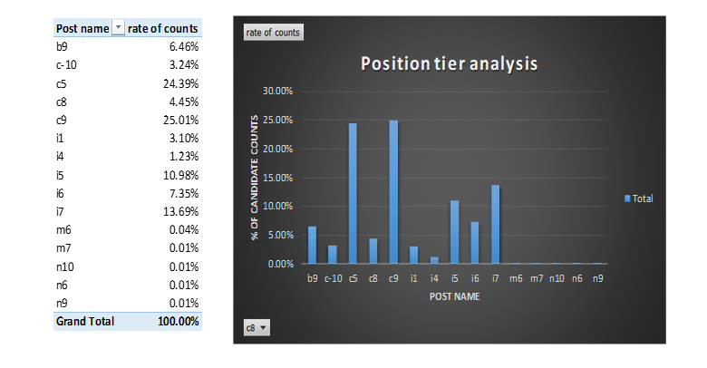

# Hiring Process Analytics
 The project focuses on analysing the company's hiring process dataset to derive  actionable insights and trends
# Project Description
The project focuses on analysing the company's hiring process dataset to derive 
actionable insights and trends. By examining critical factors such as application 
ID, interview dates, status updates, event names, departmental information, 
post titles, and offered salaries, the aim is to provide valuable information for 
optimizing recruitment strategies and improving organizational efficiency. 
Through rigorous data collection, cleansing, exploratory analysis, and statistical 
methodologies, the project seeks to uncover patterns and correlations that can 
guide decision-making within the hiring department. Ultimately, the insights 
gleaned from this analysis will facilitate the streamlining of recruitment 
processes, enhancement of candidate experiences, and achievement of staffing 
objectives with greater precision.
# Approach
After accessing the data in excel, I started with checking general things about 
data like column names and their values, I checked if there are any null values, 
out of entire dataset there was only one null value found in offered salary 
column, since it was only one column, I decided to delete it. Then I started 
looking for outliers in the data set using conditional formatting and Large small 
functions in excel, I found 5 outliers in the data set but they didn’t seem to be a 
measurement error so I decided to keep them. there was only one error in post 
names “- “and it belonged to sales department which has highest count of c5 
post name hence I changed the “- “to “c5”.
# Tech Stack Used
Microsoft Excel 2021 version is used for this project due to its simplicity of use 
and extraordinary analysis and visualization capability.
-Observations

# Insights

• It is observed from the table of Hiring analysis that Male candidates has 
the highest number of hired counts followed by female and those who do 
not wish to disclose their gender, but if we look deeper, it is understood 
that out of all applications male applicants are the highest in application 
counts followed by female and those who do not wish to disclose their 
gender. It is observed from total counts that female has higher rate of 
recruitment ie. 69.38% against male having 62.76% rate and those who 
don’t disclose has 68.19%, hence it is understood that encouraging more 
females to apply may result in faster recruitment and less time and 
resources may require for recruitment.

• In salary analysis and salary distribution it is understood that candidates 
having salary above and below 50,000 is almost same with a minor 
difference of 61 counts being more under 50,000, this information can be 
useful to negotiate salaries with potential candidates.

• It is observed from the table that operations department has the highest 
rate of working employees 39.24% followed by service department 
28.36% while least rate of employee is in Human resource department, 
this information is very helpful in finding out many matrices like revenue 
per employee of that particular department etc.

• It is observed from the result table that c9 post name has the highest 
candidate counts followed by c5. Post name like m6, m7, n10, n6, n9 all 
combined accounts for only 0.1% counts of candidates.

# Results
A. No. of Male hired = 2563, No. of Female hired = 1856

B. Mean salary offered including outliers= 49983.03 and excluding outliers 
= 49857.33

C. Largest group of candidates is 40,000 to 50,000 salary range having 776 
counts.

D. Operation department has the highest rate of workforce i.e 39.24%

E. A quarter of entire workforce is entitled c9 post name.